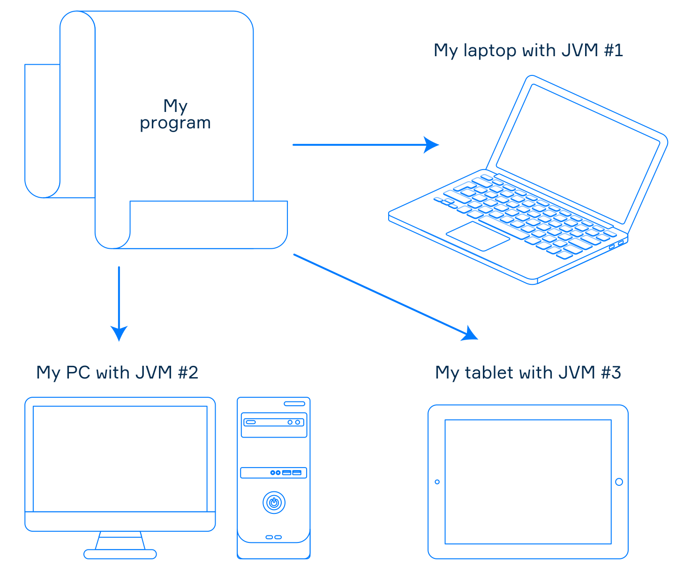

# Viết, biên dịch và chạy

## Mục lục

- [Viết chương trình](#viết-chương-trình)
- [Biên soạn](#biên-soạn)
- [Chạy một chương trình](#chạy-một-chương-trình)
- [Ngôn ngữ JVM](#ngôn-ngữ-jvm)
- [Phần kết luận](#phần-kết-luận)

---

Ngay cả khi bạn không phải là một lập trình viên giàu kinh nghiệm, bạn có thể đã nghe nói đôi chút về Java. Nó không chỉ là một ngôn ngữ lập trình mà còn là một nền tảng phần mềm được sử dụng rộng rãi. Trong chủ đề này, bạn sẽ có được một số ý tưởng thiết yếu về nền tảng Java và học cách viết và chạy chương trình của mình trong môi trường Java.

---

## Viết chương trình

Là một nhà phát triển, điều đầu tiên bạn làm khi tạo chương trình là viết **mã nguồn** vào một tệp văn bản thuần túy và lưu nó với phần mở rộng tương ứng với ngôn ngữ lập trình bạn đã chọn ( .javaví dụ như Java, .ktKotlin, v.v.). Một chương trình đơn lẻ bao gồm một hoặc nhiều tệp như vậy, chứa các lệnh chỉ định chức năng của chương trình. Mã nguồn phải tuân theo các quy tắc cú pháp của ngôn ngữ tương ứng và dễ đọc, dễ hiểu.

---

## Biên soạn

Sau khi mã được viết xong, bạn cần cho máy tính chạy chương trình. Vì máy tính không hiểu mã nguồn, nó cần được dịch sang định dạng mà máy tính có thể hiểu được. Đó là lúc một chương trình đặc biệt gọi là **trình biên dịch** trở nên hữu ích. Mã thu được sau khi biên dịch được gọi là mã gốc hoặc mã cấp thấp. Mỗi nền tảng máy tính sử dụng các lệnh cấp thấp khác nhau, giống như mọi người trên thế giới nói các ngôn ngữ khác nhau. Điều này tạo ra thêm một thách thức khi sử dụng một chương trình trên các thiết bị khác nhau.

Trong thế giới Java, trình biên dịch ( javac công cụ dành cho Java hoặc kotlinc công cụ dành cho Kotlin) dịch mã nguồn thành một dạng biểu diễn trung gian được gọi là **mã byte Java**, được lưu trữ trong các tệp có phần .class mở rộng. Máy tính không thể đọc mã byte mà không cần biên dịch, nhưng một hệ thống gọi là Máy ảo Java (JVM) có thể thực thi mã này.

---

## Chạy một chương trình

**Máy ảo Java (Java Virtual Machine)** là một ứng dụng đại diện cho một máy tính ảo theo tài liệu đặc tả JVM. Nó thực thi mã bytecode Java đã biên dịch và dịch mã này thành các lệnh cấp thấp mà máy tính có thể hiểu được. Mỗi nền tảng có phiên bản JVM riêng, nhưng vì tất cả các JVM đều tuân thủ cùng một đặc tả, chương trình của bạn sẽ hoạt động giống hệt nhau trên các thiết bị khác nhau.

Một trong những khái niệm chính của Nền tảng Java là "viết một lần, chạy mọi nơi". Điều này có nghĩa là một chương trình có thể chạy trên nhiều thiết bị khác nhau miễn là chúng được cài đặt JVM. Khái niệm này cũng thường được gọi là **tính độc lập nền tảng** hoặc tính di động.

> 😎 Điều quan trọng cần nhớ là: mã đầu vào của JVM không phụ thuộc vào nền tảng, trong khi mã đầu ra lại phụ thuộc vào nền tảng.

Một chương trình độc lập với nền tảng trong thế giới Java

Nếu JVM được cài đặt trên máy tính, bạn có thể chạy chương trình JVM đã biên dịch bằng java công cụ này. Công cụ sẽ mở một tệp có phần mở rộng là .exe để khởi chạy chương trình từ tệp này. Công cụ này giống nhau cho tất cả các ngôn ngữ JVM .class

Hình ảnh bên dưới tóm tắt ngắn gọn chu trình làm việc của một chương trình JVM.

---

## Ngôn ngữ JVM

Nền tảng Java cho phép sử dụng nhiều hơn một ngôn ngữ lập trình để tạo chương trình. Điều này đạt được nhờ thiết kế của JVM: nó không biết gì về bất kỳ ngôn ngữ lập trình cụ thể nào. Nó chỉ hiểu mã bytecode của Java. Nếu các công cụ của một ngôn ngữ lập trình có thể tạo mã bytecode, các chương trình được viết bằng ngôn ngữ đó có thể được thực thi trên JVM. Những ngôn ngữ như vậy thường được gọi là **ngôn ngữ JVM**. Chúng bao gồm Java, Kotlin, Scala, Groovy, Clojure và các ngôn ngữ khác. Vì vậy, để tạo chương trình trong thế giới Java, bạn có thể chọn ngôn ngữ thuận tiện nhất theo ý muốn.

😎 <strong>Điều quan trọng cần nhớ là:</strong> mã đầu vào của JVM không phụ thuộc vào nền tảng,
trong khi mã đầu ra lại phụ thuộc vào nền tảng.

> 😎 Ngày nay, bạn có thể tìm thấy các công cụ để tạo mã byte Java cho hầu hết mọi ngôn ngữ lập trình, điều này có nghĩa là hầu như không có ngôn ngữ nào không phải là ngôn ngữ JVM.

Có thể sử dụng nhiều ngôn ngữ lập trình khác nhau để viết chương trình trong thế giới Java

---

## Phần kết luận

- Các nhà phát triển viết mã nguồn chương trình trong các tệp văn bản có phần mở rộng phù hợp.

- Trình biên dịch dịch mã nguồn thành mã bytecode Java được lưu trữ trong .class các tệp.

- Máy ảo Java thực thi mã byte, đưa ra các lệnh cấp thấp cho máy tính.

- Tất cả JVM đều được xác định theo đặc tả JVM, do đó đảm bảo tính độc lập về nền tảng cho các chương trình.
